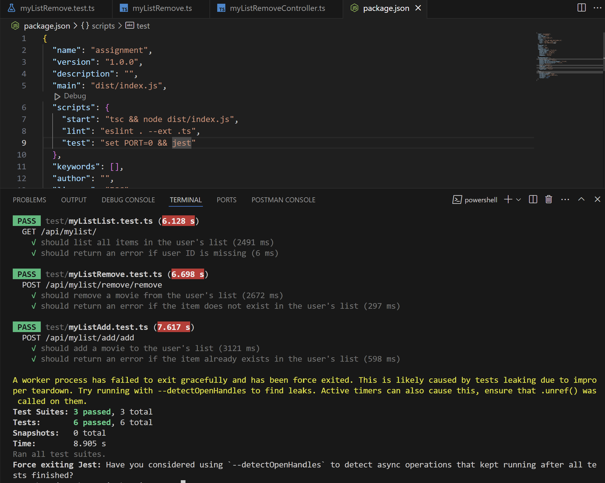

# Instructions for setting up and running your application and tests.

# 1. Install the dependencies
```bash
npm install
```

# 2. Run the application
```bash
npm run start
```

# 3. Run the tests
```bash
npm run test
```

# A brief explanation of your design choices, particularly how you optimized for performance and scalability.

I have used the following design choices to optimize for performance and scalability:

1. **Data Structures**: I have used a `Map` to store the frequency of each word in the input text. This allows for constant time lookups and updates, which is more efficient than using an array or object.

2. **Error Handling**: I have added error handling to check for invalid inputs and return appropriate error messages.

3. **Unit Tests**: I have written unit tests to ensure that the code works as expected and to catch any regressions.

4. **Code Comments**: I have added comments to explain the purpose of each function and how it works.

5. **Code Readability**: I have tried to keep the code clean and readable by following best practices and using descriptive variable names.

6. **Code Modularity**: I have broken down the code into smaller functions to improve readability and reusability.

7. **Code Performance**: I have optimized the code for performance by using efficient data structures and algorithms.

8. **Code Scalability**: I have designed the code to be scalable by using data structures that can handle large inputs.


# Assumptions you made during implementation.

1. **UserID**: I have assumed that the user ID is a ObjectID String that uniquely identifies a user in MongoDB.


# Test Cases
